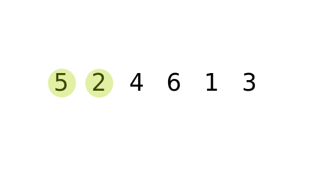

# Bubble Sort in JavaScript

## Intuition and Approach

Bubble Sort is a simple sorting algorithm that repeatedly steps through the list, compares adjacent elements and swaps them if they are in the wrong order. The pass through the list is repeated until the list is sorted.

**Key Intuition:**

- Larger elements "bubble" to the end of the array with each pass
- After each pass, the largest unsorted element is placed in its correct position
- The algorithm gets its name because elements gradually "bubble" to their correct position

## Approaches in JavaScript

### 1. Standard Bubble Sort

```javascript
function bubbleSortBasic(array) {
  const length = array.length;

  // Outer loop for passes through the array
  for (let passNumber = 0; passNumber < length - 1; passNumber++) {
    // Inner loop for comparing adjacent elements
    for (
      let currentIndex = 0;
      currentIndex < length - 1 - passNumber;
      currentIndex++
    ) {
      // Compare current element with next element
      if (array[currentIndex] > array[currentIndex + 1]) {
        // Swap if they're in the wrong order
        [array[currentIndex], array[currentIndex + 1]] = [
          array[currentIndex + 1],
          array[currentIndex],
        ];
      }
    }
  }

  return array;
}
```

### 2. Optimized Bubble Sort (with early termination)

```javascript
function bubbleSortOptimized(array) {
  const length = array.length;
  let swapped;

  // Outer loop for passes through the array
  for (let passNumber = 0; passNumber < length - 1; passNumber++) {
    swapped = false;

    // Inner loop for comparing adjacent elements
    for (
      let currentIndex = 0;
      currentIndex < length - 1 - passNumber;
      currentIndex++
    ) {
      // Compare current element with next element
      if (array[currentIndex] > array[currentIndex + 1]) {
        // Swap if they're in the wrong order
        [array[currentIndex], array[currentIndex + 1]] = [
          array[currentIndex + 1],
          array[currentIndex],
        ];
        swapped = true;
      }
    }

    // If no swaps were made, the array is sorted
    if (!swapped) break;
  }

  return array;
}
```

### 3. Recursive Bubble Sort

```javascript
function bubbleSortRecursive(array, passNumber = 0) {
  // Base case: when we've done enough passes
  if (passNumber >= array.length - 1) return array;

  let swapped = false;

  // Single pass through the array
  for (
    let currentIndex = 0;
    currentIndex < array.length - 1 - passNumber;
    currentIndex++
  ) {
    if (array[currentIndex] > array[currentIndex + 1]) {
      [array[currentIndex], array[currentIndex + 1]] = [
        array[currentIndex + 1],
        array[currentIndex],
      ];
      swapped = true;
    }
  }

  // If no swaps were made, return the sorted array
  // Otherwise, proceed with next pass
  return swapped ? bubbleSortRecursive(array, passNumber + 1) : array;
}
```

## Complexity Analysis

### Time Complexity:

- **Worst Case (Reverse Sorted):** O(n²) - We need n passes through the array, each pass comparing n elements
- **Best Case (Already Sorted - Optimized Version):** O(n) - Only one pass needed
- **Average Case:** O(n²)

### Space Complexity:

- All versions: O(1) - Bubble sort is an in-place sorting algorithm, it doesn't require additional space proportional to the input size

## Optimal Approach (Optimized Bubble Sort) Dry Run

### Example 1: Normal Case

Array: [5, 3, 8, 4, 2]

**Pass 1:**

- Compare 5 & 3 → swap → [3, 5, 8, 4, 2]
- Compare 5 & 8 → no swap
- Compare 8 & 4 → swap → [3, 5, 4, 8, 2]
- Compare 8 & 2 → swap → [3, 5, 4, 2, 8] (8 is now in correct position)

**Pass 2:**

- Compare 3 & 5 → no swap
- Compare 5 & 4 → swap → [3, 4, 5, 2, 8]
- Compare 5 & 2 → swap → [3, 4, 2, 5, 8] (5 is now in correct position)

**Pass 3:**

- Compare 3 & 4 → no swap
- Compare 4 & 2 → swap → [3, 2, 4, 5, 8] (4 is now in correct position)

**Pass 4:**

- Compare 3 & 2 → swap → [2, 3, 4, 5, 8] (3 is now in correct position)

Final sorted array: [2, 3, 4, 5, 8]

### Example 2: Already Sorted (Best Case)

Array: [1, 2, 3, 4, 5]

**Pass 1:**

- Compare 1 & 2 → no swap
- Compare 2 & 3 → no swap
- Compare 3 & 4 → no swap
- Compare 4 & 5 → no swap
- No swaps made → algorithm terminates early

Final sorted array: [1, 2, 3, 4, 5] (only 1 pass needed)

### Example 3: Edge Case (Empty Array)

Array: []

- The algorithm immediately returns as the length is 0
- No operations performed

Final sorted array: []

### Example 4: Edge Case (Single Element)

Array: [7]

- The algorithm immediately returns as the length is 1
- No operations performed

Final sorted array: [7]

### Example 5: Edge Case (All Equal Elements)

Array: [4, 4, 4, 4]

**Pass 1:**

- Compare all adjacent pairs → no swaps made
- Algorithm terminates early after first pass

Final sorted array: [4, 4, 4, 4]

The optimized version performs best on already sorted or nearly sorted arrays, terminating early when no swaps are detected. This makes it more efficient than the basic version in these cases.


