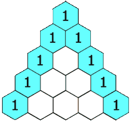

### LC- 118 Understanding Pascal's Triangle

**Pascal's Triangle** is a triangular array of numbers where each number is the sum of the two directly above it. The triangle starts with a single `1` at the top, and each subsequent row starts and ends with `1`, with the interior numbers being the sum of the two numbers above them.

For example, the first 5 rows of Pascal's Triangle are:

```
Row 1: [1]
Row 2: [1, 1]
Row 3: [1, 2, 1]
Row 4: [1, 3, 3, 1]
Row 5: [1, 4, 6, 4, 1]
```



### Intuition and Approach

1. **Identify the Pattern**:

   - The first and last elements of each row are always `1`.
   - Each interior element at position `i` in row `n` is the sum of the elements at positions `i-1` and `i` in row `n-1`.

2. **Approaches to Generate Pascal's Triangle**:
   - **Iterative Approach**: Build each row iteratively using the previous row.
   - **Recursive Approach**: Generate rows recursively, but this is less efficient due to repeated calculations.
   - **Mathematical Approach (Combination Formula)**: Use the combination formula to calculate each element, but this is computationally intensive for large rows.

#### Approach 1: Iterative Approach

```javascript
/**
 * Generates Pascal's Triangle up to the given number of rows iteratively.
 * @param {number} numRows - The number of rows to generate.
 * @return {number[][]} - The generated Pascal's Triangle.
 */
function generatePascalsTriangle(numRows) {
  if (numRows === 0) return [];

  const triangle = [[1]]; // Initialize with the first row

  for (let currentRow = 1; currentRow < numRows; currentRow++) {
    const previousRow = triangle[currentRow - 1];
    const newRow = [1]; // First element is always 1

    for (let col = 1; col < currentRow; col++) {
      // Each element is the sum of the two elements above it
      newRow.push(previousRow[col - 1] + previousRow[col]);
    }

    newRow.push(1); // Last element is always 1
    triangle.push(newRow);
  }

  return triangle;
}

// Example Usage:
console.log(generatePascalsTriangle(5));
// Output: [[1],[1,1],[1,2,1],[1,3,3,1],[1,4,6,4,1]]
```

#### Approach 2: Recursive Approach

```javascript
/**
 * Generates Pascal's Triangle up to the given number of rows recursively.
 * @param {number} numRows - The number of rows to generate.
 * @return {number[][]} - The generated Pascal's Triangle.
 */
function generatePascalsTriangleRecursive(numRows) {
  if (numRows === 0) return [];
  if (numRows === 1) return [[1]];

  const triangle = generatePascalsTriangleRecursive(numRows - 1);
  const previousRow = triangle[numRows - 2];
  const newRow = [1];

  for (let i = 1; i < numRows - 1; i++) {
    newRow.push(previousRow[i - 1] + previousRow[i]);
  }

  newRow.push(1);
  triangle.push(newRow);

  return triangle;
}

// Example Usage:
console.log(generatePascalsTriangleRecursive(5));
// Output: [[1],[1,1],[1,2,1],[1,3,3,1],[1,4,6,4,1]]
```

### Dry Run for `numRows = 3`

#### Iterative Approach:

1. Initialize `triangle = [[1]]`.
2. For `currentRow = 1`:
   - `previousRow = [1]`.
   - `newRow = [1]`.
   - Loop `i = 1` to `0` (no iterations).
   - `newRow = [1, 1]`.
   - `triangle = [[1], [1, 1]]`.
3. For `currentRow = 2`:
   - `previousRow = [1, 1]`.
   - `newRow = [1]`.
   - Loop `i = 1` to `1`:
     - `newRow.push(1 + 1) => [1, 2]`.
   - `newRow = [1, 2, 1]`.
   - `triangle = [[1], [1, 1], [1, 2, 1]]`.
4. Return `triangle`.

#### Recursive Approach:

1. `generate(3)` calls `generate(2)`:
   - `generate(2)` calls `generate(1)`:
     - `generate(1)` returns `[[1]]`.
   - `generate(2)`:
     - `previousRow = [1]`.
     - `newRow = [1, 1]`.
     - `triangle = [[1], [1, 1]]`.
2. `generate(3)`:
   - `previousRow = [1, 1]`.
   - `newRow = [1, 2, 1]`.
   - `triangle = [[1], [1, 1], [1, 2, 1]]`.
3. Return `triangle`.
